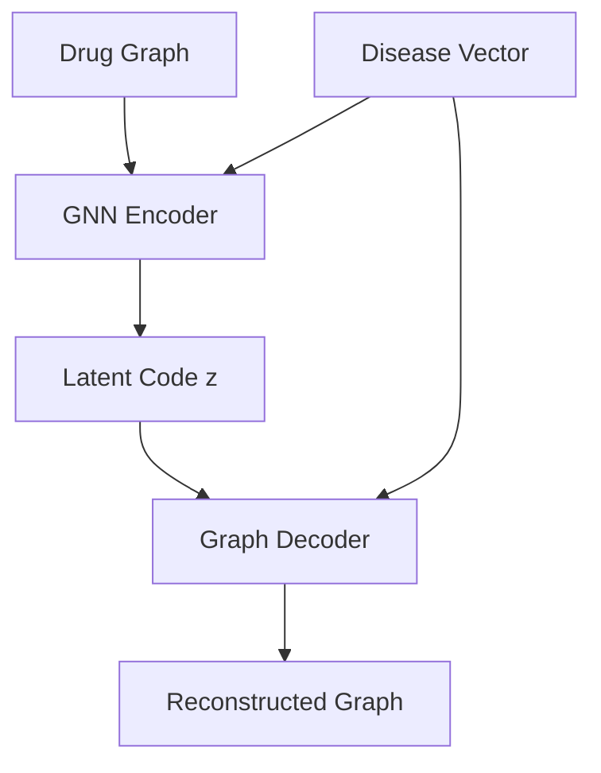

# Conditional Molecule Generation for Drug Discovery

This repository implements a conditional graph variational autoencoder (GraphVAE) for generating novel drug molecules conditioned on disease representations. The model is trained on known drug–disease pairs and can generate candidate molecules for diseases with no known cures.

## Features

- Modular PyTorch Geometric implementation.
- Conditional GraphVAE with disease vector conditioning.
- Comprehensive data preprocessing (SMILES → graphs, disease embeddings).
- Training, validation, and evaluation pipelines.
- Chemical filters and weighted scoring for generated molecules.
- Docker support for reproducible CPU/GPU environments.


# Pipeline Summary
```
┌─────────────────┐     ┌─────────────────┐     ┌─────────────────┐
│ Known drug-     │     │ Convert drugs   │     │ Create disease  │
│ disease pairs   │────▶│ to PyG graphs   │────▶│ vectors         │
└─────────────────┘     └─────────────────┘     └─────────────────┘
                                                          │
                                                          ▼
┌─────────────────┐     ┌────────────────-─┐     ┌─────────────────┐
│ Generate for    │◀────│ Train conditional│◀────│ Assemble        │
│ new disease     │     │ generative model │     │ dataset of pairs│
└─────────────────┘     └────────────────-─┘     └─────────────────┘
         │
         ▼
┌─────────────────┐     ┌─────────────────┐     ┌─────────────────┐
│ Filter & rank   │────▶│ Validate with   │────▶│ Promising       │
│ candidates      │     │ docking / ML    │     │ candidates      │
└─────────────────┘     └─────────────────┘     └─────────────────┘

```


## Setup

### Option 1: Docker (recommended)

1. **Clone the repository**:
   ```bash
   git clone https://github.com/shrisha-rao/conditional-molecule-generation.git
   cd conditional-molecule-generation
   ```

2. Prepare data:

    Place your drug–disease CSV in data/raw/ (see expected format below).

    (Optional) Precompute disease vectors and save as data/processed/disease_vectors.pt.
   
3. Build and run with Docker Compose:

    For CPU:
	```bash
    docker compose -f docker/docker-compose.yml up cpu
	```
	
    For GPU:
	```bash
	docker compose -f docker/docker-compose.yml up gpu	
	```	
	
 - To override the command (e.g., run data preparation first):	
   ```bash
   docker-compose run cpu python scripts/prepare_data.py --dataset hcdt --output data/raw/drug_disease_pairs.csv
   ```
# Model Design (Conditional Graph Generative Model)



- Encoder: A GNN (e.g., GIN, GCN) that takes the drug graph and the disease vector (concatenated to node features or as a global graph attribute) and outputs a graph‑level embedding. Then two heads produce $\mu$ and $log(\sigma)$ for the latent Gaussian.

- Decoder: A graph generator that takes z (sampled from the latent) and the disease vector to produce a new graph. This is the hardest part.
	- Options:

  		- Autoregressive decoder (like in GraphRNN) – generates nodes and edges step‑by‑step.

  		- One‑shot decoder (like in GraphVAE) – predicts a probabilistic fully‑connected graph and then refines.

  		- Fragment‑based decoder – assembles molecules from common fragments (more constrained, higher validity).

- Loss: Reconstruction loss (e.g., cross‑entropy for node types and edges) + KL divergence.


# Tools
 - RDKit – for SMILES handling and molecule validation.
 - PyTorch Geometric – for graph neural networks.
 - PyTorch – base framework.
 - Pre‑trained protein models – e.g., ESM (Meta).
 - Disease ontologies – Disease Ontology, DisGeNET.
 - Optional: TDC for evaluation metrics and predictors.

## Project Structure

```
create a bash script to generate this folder structure:
conditional-molecule-generation/
├── config/                  # Configuration files (YAML)
│   ├── data.yaml            # Dataset paths, disease embedding method
│   ├── model.yaml           # Model hyperparameters
│   └── train.yaml           # Training settings
├── data/                    # Data handling
│   ├── dataset.py           # Custom PyG Dataset for drug-disease pairs
│   ├── preprocessing.py     # SMILES → PyG graph, disease vector computation
│   └── utils.py             # Helpers (e.g., molecule validation)
├── models/                  # Model architectures
│   ├── base.py              # Abstract base class for conditional generators
│   ├── graphvae.py          # Conditional GraphVAE implementation
│   └── components/          # Shared modules (GNN layers, decoders)
│       ├── encoder.py
│       ├── decoder.py
│       └── latent.py
├── training/                # Training routines
│   ├── trainer.py           # Main training loop
│   ├── loss.py              # VAE loss (reconstruction + KL)
│   └── metrics.py           # Evaluation metrics (validity, uniqueness, QED, etc.)
├── evaluation/              # Post‑generation filtering and scoring
│   ├── filters.py           # Chemical filters (QED, SA, Lipinski)
│   ├── scoring.py           # Weighted score computation
│   └── benchmark.py         # Evaluate on test set (known drugs)
├── generation/              # Inference for new diseases
│   ├── sample.py            # Generate molecules conditioned on disease vector
│   └── postprocess.py       # Convert graphs to SMILES, deduplicate, rank
├── scripts/                 # Utility scripts
│   ├── prepare_data.py      # Download/process raw data
│   ├── compute_disease_vecs.py # Precompute disease embeddings
│   └── run_experiment.py    # End‑to‑end training + evaluation
├── docker/                  # Docker configuration
│   ├── Dockerfile
│   └── docker-compose.yml   # Optional for GPU support
├── requirements.txt         # Python dependencies
├── environment.yml          # Conda environment (alternative)
└── README.md                # Project documentation
```


---

# Data Format

The main CSV file should have at least two columns:

    smiles: SMILES string of the drug.

    disease_id: Unique identifier for the disease (e.g., MeSH ID, DOID).
	
	```text
	smiles,disease_id
	CC(C)CC1=CC=C(C=C1)C(C)C(=O)O,DOID:1234
	CN1C=NC2=C1C(=O)N(C(=O)N2C)C,DOID:5678	
	```
	
# Configuration

Edit YAML files in config/ to change:

    Data paths and disease embedding method (data.yaml).

    Model hyperparameters (model.yaml).

    Training settings (train.yaml).
	
	
# Generating for a New Disease

Use the generation/sample.py script with a trained model and a disease vector. Example:

```python
from models.graphvae import ConditionalGraphVAE
from generation.sample import generate_for_disease

model = ConditionalGraphVAE.load_from_checkpoint('checkpoints/best_model.pt')
disease_vec = torch.load('path/to/disease_vector.pt')
candidates = generate_for_disease(model, disease_vec, num_samples=1000)
for smi, score in candidates[:10]:
    print(f"{smi}\t{score:.3f}")
```

# Extending the Code

    To add a new generative model, inherit from models.base.BaseConditionalGenerator and implement the required methods.

    To add new filters, extend evaluation/filters.py.

    To use a different disease representation, modify data/preprocessing.py and scripts/compute_disease_vecs.py.
	
# License

MIT
